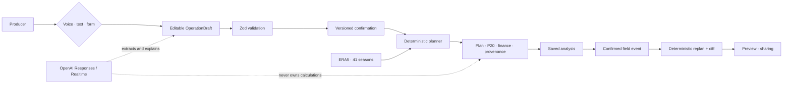

# 40 Safras — voice-first, evidence-backed planting decisions

[English](#english) · [Português](#português-pt-br)

> A voice-first planning assistant that converts a Brazilian producer's operational
> reality into a confirmed, deterministic and auditable soybean-to-corn plan — tested
> against 41 historical seasons and ready to be recalculated when field conditions change.

---

# English

## Why 40 Safras?

Planting order is not just a calendar decision. A producer must combine field size,
planter capacity, seed-lot cycles, second-crop targets, weather history and financial
assumptions. When a field is blocked or seed availability changes, the original plan can
become obsolete within hours.

**40 Safras** turns a spoken, typed or structured operational brief into one shared
editable draft. The producer reviews it, explicitly confirms it and receives a planting
sequence generated by deterministic code. The same operation is simulated across **41
historical seasons**, producing traceable risk and financial metrics. A confirmed field
event generates a new plan and an explainable before/after diff.

## Three-minute product journey

1. Sign in with the single demo user.
2. Select a Brazilian municipality and load its climate evidence.
3. Describe the operation by voice, natural-language text or form.
4. Review missing fields and ambiguities in the same editable draft.
5. Confirm the current draft by voice or button.
6. Generate the deterministic plan and inspect all 41 historical outcomes.
7. Save the analysis.
8. Report a critical event, confirm it and generate an auditable replan.
9. Compare the diff and prepare the result for sharing.

## What makes it different

- **Voice is an input, not an authority.** OpenAI Realtime collects information and can
  call bounded tools, but every argument is validated locally.
- **The model does not calculate the plan.** Dates, feasibility, P20, ranking, finance,
  hashes and replans come from pure deterministic TypeScript functions.
- **Confirmation is versioned.** Editing a draft invalidates its previous short-lived
  confirmation token, preventing stale voice or button actions.
- **Evidence is visible.** The UI distinguishes live data, cache and prepared offline
  fixtures instead of hiding fallbacks.
- **The demo survives external failures.** Text/form entry, the planning engine, saved
  local analyses and prepared 41-season datasets remain available without voice or network.

## Architecture



### Responsibility boundaries

| Layer | Responsibility |
|---|---|
| OpenAI Responses | Structured extraction from typed briefs/events and concise explanations |
| OpenAI Realtime | Low-latency Portuguese voice, interruption and bounded tool calls over WebRTC |
| Zod contracts | Runtime validation shared by AI, APIs, forms and engine |
| Deterministic engine | Candidate generation, simulation, P20 metrics, finance, ranking and diff |
| Data adapters | Municipality resolution, ERA5 history, forecast, cache and offline fixtures |
| Next.js application | UI, server-only secrets, authenticated persistence and API orchestration |

## Data and provenance

### Historical planning evidence

- Open-Meteo Archive API with the **ERA5** model.
- Fixed UTC period: `1985-07-01` through `2026-06-30`.
- Four validated daily series: precipitation, FAO ET0, minimum temperature and maximum
  temperature.
- Exactly 41 agricultural seasons in the normalized engine contract.
- Municipality metadata cross-referenced with IBGE when available.
- Prepared offline datasets for Sorriso/MT, Rio Verde/GO and Luís Eduardo Magalhães/BA.

### Operational forecast

The separate seven-day Open-Meteo forecast exposes WMO condition, rain accumulation,
probability, temperature range, ET0 and wind gusts for the selected model cell. It does
**not** silently alter the historical planner. Its alerts are deterministic prototype
signals, not agronomic prescriptions.

### Territory search

OpenStreetMap Nominatim supports explicit place/address search. Results must always be
shown for human selection; the application never assumes that the first result is the
intended municipality or property.

## Reliability and security

- The long-lived OpenAI project key is server-only.
- The browser receives only a short-lived Realtime client secret.
- Raw microphone audio is not persisted.
- AI output and Realtime tool arguments are treated as untrusted input.
- One malformed structured response is retried once; then the app returns an editable,
  clearly labeled recovery or prepared fixture.
- Numeric model explanations are checked against the real `PlanResult`; unsupported
  numbers are discarded in favor of deterministic copy.
- Authentication uses a signed, HTTP-only, SameSite cookie with an eight-hour lifetime.
- Analysis persistence is local and serialized; confirmation tokens are never persisted.
- `.env.local`, analysis data and secrets are ignored by Git.

## Technology

| Area | Choice |
|---|---|
| Application | Next.js 16 App Router, React 19, TypeScript strict |
| Validation | Zod 4 |
| AI | Official OpenAI JavaScript SDK, Responses API |
| Voice | OpenAI Agents SDK, RealtimeAgent/RealtimeSession, browser WebRTC |
| Engine | Pure TypeScript, deterministic and side-effect free |
| Data | Open-Meteo ERA5/Forecast, IBGE, Nominatim, local cache/fixtures |
| Tests | Vitest, Testing Library, contract and route tests |

## Run locally

### Requirements

- Node.js `22.22.0`
- npm `10.x`
- An OpenAI API project with billing enabled for live Responses and Realtime voice

### Installation

```bash
git clone https://github.com/Eduardo-Salvador/40safras-open-ai-hackathon.git
cd 40safras-open-ai-hackathon
git switch main
npm install
```

Create `.env.local` from `.env.example`. Never commit the real file.

```dotenv
OPENAI_API_KEY=replace_with_server_only_project_key
OPENAI_MODEL=gpt-5.6-terra
OPENAI_REALTIME_MODEL=gpt-realtime-2.1-mini
APP_LOGIN_USER=demo
APP_LOGIN_PASSWORD=replace_with_a_strong_demo_password
SESSION_SECRET=replace_with_at_least_32_random_characters
```

Start the development server:

```bash
npm run dev
```

Open [http://localhost:3000](http://localhost:3000), use the credentials configured in
`.env.local` and allow microphone access when prompted.

### Production build

```bash
npm run build
npm start
```

## Verification

```bash
# TypeScript + ESLint + complete test suite
npm run check

# One focused proof of login → plan → save → event → replan
npm run demo:check

# Production compilation and route generation
npm run build
```

At the latest consolidated backend/data handoff: **26 test files and 132 tests passed**,
the production build generated **19 routes**, ERA5 returned 41 live seasons, Responses
returned structured OpenAI output and Realtime issued a valid ephemeral client secret.

## API overview

| Flow | Endpoint |
|---|---|
| Authentication | `POST /api/auth/login`, `GET /api/auth/session`, `POST /api/auth/logout` |
| Municipality/history | `GET /api/locations`, `POST /api/climate` |
| Territory/forecast | `GET /api/territory-search`, `GET /api/weather` |
| AI extraction | `POST /api/parse-brief`, `POST /api/parse-event` |
| Voice | `POST /api/realtime-session` |
| Confirmation | `POST /api/confirmations` |
| Planning | `POST /api/plan`, `POST /api/replan`, `POST /api/explain-plan` |
| Saved analyses | `GET|POST /api/analyses`, `GET /api/analyses/:id`, `POST /api/analyses/:id/replan` |

The complete payload and error contract is documented in
[`docs/API_CONTRACT.md`](docs/API_CONTRACT.md).

## Repository map

```text
src/app/          Next.js pages and API route handlers
src/components/   User interface and input modes
src/domain/       Frozen schemas and deterministic planning/replanning engine
src/data/         Geocoding, historical climate, forecast, cache and normalization
src/lib/          OpenAI, Realtime, auth, confirmation, persistence and sharing
src/prompts/      Bounded extraction/explanation/voice instructions
data/fixtures/    Frozen contracts, AI recovery and prepared municipalities
data/crops/       Reviewed crop profiles
tests/            Contract, engine, API, AI, auth and end-to-end journey tests
docs/             Architecture, API, product specs, execution plans and evidence
```

## Prototype scope and limitations

- 40 Safras is decision support for a hackathon prototype, not an agronomic prescription,
  crop insurance product, ZARC replacement or financial guarantee.
- Financial values are declared user assumptions and are always labeled as such.
- Local analysis persistence (`.data/analyses.json`) is ideal for the offline demo but is
  not durable on an ephemeral serverless filesystem; production requires a database adapter.
- Live voice requires an API project with billing; text/form and deterministic fallbacks
  preserve the core journey when Realtime is unavailable.
- Territory boundaries drawn by a user do not represent CAR, title or official cadastral
  limits. Map imagery and providers require license review before commercial use.

## Team ownership

| Area | Owner branch |
|---|---|
| Backend, contracts, APIs and OpenAI | `Eduarco` |
| Deterministic analytics engine | `Pedro` |
| External data, ERA5, geocoding and forecast | `Vitor` / `cadastro/terrorio` |
| Frontend, interaction and final demo | `Murilo` |
| Consolidated backend/data handoff | `consolidado-back-dados` |

---

# Português (PT-BR)

## Por que 40 Safras?

A ordem de plantio não é apenas uma decisão de calendário. O produtor precisa combinar
área dos talhões, capacidade da plantadeira, ciclos dos lotes de sementes, meta de
safrinha, histórico climático e premissas financeiras. Quando um talhão fica bloqueado
ou o estoque muda, o plano original pode ficar obsoleto em poucas horas.

O **40 Safras** transforma um relato falado, digitado ou preenchido em um único rascunho
editável. O produtor revisa, confirma explicitamente e recebe uma sequência gerada por
código determinístico. A mesma operação é simulada contra **41 safras históricas**, com
métricas de risco e financeiras rastreáveis. Um evento confirmado gera novo plano e um
diff explicável entre antes e depois.

## Jornada de demonstração em três minutos

1. Entrar com o único usuário da demonstração.
2. Selecionar um município brasileiro e carregar as evidências climáticas.
3. Descrever a operação por voz, texto natural ou formulário.
4. Revisar campos ausentes e ambiguidades no mesmo rascunho editável.
5. Confirmar a versão atual por voz ou botão.
6. Gerar o plano determinístico e mostrar os 41 resultados históricos.
7. Salvar a análise.
8. Relatar um evento crítico, confirmar e gerar o replano auditável.
9. Comparar o diff e preparar o resultado para compartilhamento.

## Diferenciais

- **A voz é entrada, não autoridade.** O OpenAI Realtime coleta informações e chama
  ferramentas limitadas, mas todos os argumentos passam por validação local.
- **A IA não calcula o plano.** Datas, viabilidade, P20, ranking, finanças, hashes e
  replano vêm de funções TypeScript puras e determinísticas.
- **A confirmação possui versão.** Qualquer edição invalida o token curto anterior e
  impede ações obsoletas por voz ou botão.
- **A evidência fica visível.** A interface diferencia dado ao vivo, cache e fixture
  offline, sem esconder fallback.
- **A demo sobrevive a falhas externas.** Texto/formulário, motor, análises locais e
  datasets preparados de 41 safras continuam disponíveis sem voz ou rede.

## Como funciona

```text
voz | texto | formulário
        ↓
rascunho editável → Zod → confirmação versionada
        ↓
motor determinístico + histórico ERA5 de 41 safras
        ↓
plano → análise salva → evento confirmado → replano + diff
```

A OpenAI interpreta e explica. O motor determinístico calcula. A UI apresenta os
payloads e não recria números de negócio.

## Dados e proveniência

- Open-Meteo Archive com modelo **ERA5** e período UTC fixo de `1985-07-01` a
  `2026-06-30`.
- Precipitação, ET0 FAO, temperatura mínima e máxima validadas diariamente.
- Exatamente 41 safras no contrato consumido pelo motor.
- Município cruzado com IBGE quando disponível.
- Fixtures offline para Sorriso/MT, Rio Verde/GO e Luís Eduardo Magalhães/BA.
- Previsão separada de sete dias com condição WMO, chuva, probabilidade, temperatura,
  ET0 e rajadas.
- Busca territorial pelo OpenStreetMap Nominatim sempre exige seleção humana.

A previsão de sete dias não altera silenciosamente o planner histórico. Os sinais são
heurísticas determinísticas do protótipo, não prescrição agronômica.

## Confiabilidade e segurança

- A chave longa da OpenAI fica somente no servidor.
- O navegador recebe apenas um segredo efêmero do Realtime.
- O áudio bruto do microfone não é persistido.
- Saídas da IA e argumentos de ferramentas são sempre tratados como não confiáveis.
- Uma resposta estruturada inválida recebe uma única nova tentativa; depois o sistema
  oferece recuperação editável ou fixture claramente rotulada.
- Explicações numéricas são verificadas contra o `PlanResult` real.
- Login usa cookie assinado, HTTP-only e SameSite, válido por oito horas.
- Tokens de confirmação nunca são persistidos.
- `.env.local`, dados locais de análise e segredos ficam fora do Git.

## Rodar localmente

### Requisitos

- Node.js `22.22.0`
- npm `10.x`
- Projeto da OpenAI API com billing ativo para Responses e voz Realtime ao vivo

### Instalação

```bash
git clone https://github.com/Eduardo-Salvador/40safras-open-ai-hackathon.git
cd 40safras-open-ai-hackathon
git switch main
npm install
```

Crie `.env.local` a partir de `.env.example`. Nunca envie o arquivo real ao Git.

```dotenv
OPENAI_API_KEY=replace_with_server_only_project_key
OPENAI_MODEL=gpt-5.6-terra
OPENAI_REALTIME_MODEL=gpt-realtime-2.1-mini
APP_LOGIN_USER=demo
APP_LOGIN_PASSWORD=replace_with_a_strong_demo_password
SESSION_SECRET=replace_with_at_least_32_random_characters
```

Execute:

```bash
npm run dev
```

Abra [http://localhost:3000](http://localhost:3000), use as credenciais configuradas no
`.env.local` e autorize o microfone quando solicitado.

### Verificação

```bash
npm run check       # TypeScript, ESLint e todos os testes
npm run demo:check  # login → plano → salvar → evento → replano
npm run build       # build de produção e geração das rotas
```

No handoff consolidado mais recente: **26 arquivos de teste e 132 testes aprovados**,
build de produção com **19 rotas**, ERA5 ao vivo com 41 safras, Responses retornando
saída estruturada e Realtime emitindo segredo efêmero válido.

## APIs principais

| Fluxo | Endpoint |
|---|---|
| Autenticação | `POST /api/auth/login`, `GET /api/auth/session`, `POST /api/auth/logout` |
| Município/histórico | `GET /api/locations`, `POST /api/climate` |
| Território/previsão | `GET /api/territory-search`, `GET /api/weather` |
| Extração por IA | `POST /api/parse-brief`, `POST /api/parse-event` |
| Voz | `POST /api/realtime-session` |
| Confirmação | `POST /api/confirmations` |
| Planejamento | `POST /api/plan`, `POST /api/replan`, `POST /api/explain-plan` |
| Análises salvas | `GET|POST /api/analyses`, `GET /api/analyses/:id`, `POST /api/analyses/:id/replan` |

O contrato completo de payloads e erros está em
[`docs/API_CONTRACT.md`](docs/API_CONTRACT.md).

## Limites do protótipo

- O 40 Safras é apoio à decisão de um protótipo de hackathon, não prescrição agronômica,
  seguro rural, substituto do ZARC ou garantia financeira.
- Valores financeiros são premissas informadas pelo usuário e permanecem rotulados.
- A persistência local (`.data/analyses.json`) é adequada à demo offline, mas produção
  serverless exige um adapter de banco de dados.
- Voz ao vivo exige billing da OpenAI API; texto/formulário e fallbacks determinísticos
  preservam a jornada quando o Realtime estiver indisponível.
- Polígonos informados pelo usuário não representam CAR, matrícula ou limite cadastral
  oficial. Imagens e provedores de mapa exigem revisão de licença para uso comercial.

## Documentação

- [Contrato completo da API](docs/API_CONTRACT.md)
- [Arquitetura e contratos](docs/ARCHITECTURE.md)
- [Stack e decisões técnicas](docs/STACK.md)
- [Especificação do MVP](docs/product-specs/MVP.md)
- [Fluxo completo em linguagem simples](docs/product-specs/PROJECT_WALKTHROUGH.md)
- [Plano do hackathon](docs/exec-plans/active/HACKATHON_PLAN.md)

## Aviso de autoria e referências

O projeto diferencia implementação criada no hackathon, fixtures preparadas, fontes
externas e referências. Dados e ativos de terceiros permanecem identificados por
provedor e proveniência e não são apresentados como produção original da equipe.
